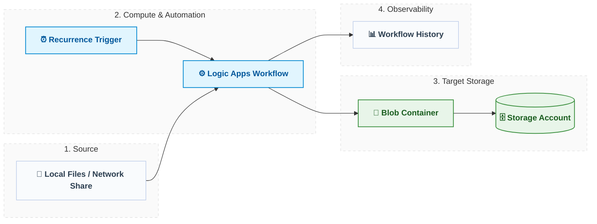

# Azure File Backup Automation (Terraform)

[](https://azure.com/)
[](https://www.terraform.io/)

A minimalist, serverless, and cost-optimized infrastructure blueprint to automate business file backups. This solution replaces risky, manual workflows with an automated Azure Logic App that securely schedules and pushes files into a private Azure Blob Storage container.



<br>

## 🛠️ Prerequisites

* **Azure CLI** (`v2.37.0+`) & authenticated session (`az login`).
* **Terraform CLI** (`v1.0+`).
* **CLI Extension:** `az extension add --name logic`

  <br>

## 🚀 Quick Start Deployment

Run these sequential steps from the `terraform/` directory to stand up the environment:

```bash
# Initialize providers
terraform init

# Review planned resources
terraform plan -var="resource_group_name=rg-backup-demo"

# Apply infrastructure
terraform apply -var="resource_group_name=rg-backup-demo" --auto-approve
```
<br>

## ⚙️ Configuration Reference

| Variable | Type | Default | Description |
| :--- | :--- | :--- | :--- |
| `resource_group_name` | string | *Required* | Target Resource Group name. |
| `location` | string | `"eastus"` | Target Azure Region. |
| `environment` | string | `"demo"` | Prefix for resource naming tags. |
| `backup_schedule_hour` | number | `2` | Execution hour (0-23) for the daily backup. |

<br>

## 🛡️ Well-Architected Design Highlights

* **🔒 Zero Hardcoded Secrets:** Uses an Entra ID **System-Assigned Managed Identity** for secure, passwordless authentication between the Logic App and Storage.
* **💰 Cost Optimization:** Utilizes the Storage **Cool Access Tier** to minimize monthly data holding costs, paired with a Logic App **Consumption Plan** (pay-per-execution, $0 standing idle fees).
* **🚫 High Isolation:** Public anonymous blob access is explicitly disabled; all data transport requires TLS 1.2 over HTTPS.

  <br>

## 🩺 Verification & Cleanup

### Post-Deployment Health Check
```bash
# Confirm the Logic App is deployed and enabled
az logic workflow show --resource-group rg-backup-demo --name la-backup-demo --query "{State:state}"

# Verify public anonymous access is blocked on the storage account
az storage account show --name stbackupdemo --resource-group rg-backup-demo --query "allowBlobPublicAccess"

# Tear Down Infrastructure
```bash
terraform destroy -var="resource_group_name=rg-backup-demo"
